# Build Fund

Build Fund is a way for the EOS/Vaulta network to fund the development of chain-revenue generating products that are owned by the network, open source, and forward fees back into the network.

**Author:** Nathan James (nsjames)

## Overview

The Build Fund helps create a flywheel of value that captures value from various sources on the network and redistributes that value back into building the ecosystem. It offsets inflationary pressures and rewards those contributing to network growth in an open, transparent, and community-driven way.

> **It's time to move past the politics, and focus on building a healthy ecosystem that rewards the efforts of the many, rather than the few.**

## Value Flywheel

```mermaid
%%{init: { "flowchart": { "padding": 40, "nodeSpacing": 60,
    "rankSpacing": 60 } }}%%
flowchart LR
  NewPeople((New Builders))
  CurrentPeople((Builders))
  Fund((Fund))
  Burns((Token Burns))
  RAM((RAM Fees))
  Resources((Resource Fees))
  
  System((System))

  BuildFund((Build Fund))

    CurrentPeople-->BuildFund
    NewPeople-->BuildFund
    Fund-->BuildFund
    BuildFund-->Burns
    BuildFund-->RAM
    BuildFund-->Resources
    Resources-->System
    RAM-->System
    Burns-->System
    System-->Fund

    style CurrentPeople fill:#000,fill-opacity:0.15,stroke:#333,stroke-width:1px
    style NewPeople fill:blue,fill-opacity:0.15,stroke:#333,stroke-width:1px
    style BuildFund stroke-dasharray:5 5,stroke:#000,stroke-width:2px,fill:#fff,fill-opacity:0.05
```



## How Does It Work?

The product is split up into three main journeys:

### Creating Proposals

Anyone can create a proposal using the UI, which will:
1. Create an MSIG from the funding account to the proposer with an A/EOS amount
2. Create a new Build Fund Proposal (BFP) on-chain using a smart contract

Each BFP contains:
- Title
- Summary
- Markdown content
- Requested Amount
- Proposer
- Timestamp
- MSIG Reference

### Reviewing & Engaging with Proposals

- BFPs can be reviewed by anyone in the community
- Only the governing body (currently block producers) can approve or reject proposals
- Community members can "burn" tokens to show support for a proposal, channeling those burnt tokens back into the system as fees
- Messages can be attached to burns, appearing as comments on the proposal
- Block producers can approve MSIG proposals to show their support

### Canceling Proposals

Proposers can cancel their proposals at any time before they are approved by the governing body. When canceled:
- The MSIG is also canceled
- Any RAM used to store the proposal is freed up

## Getting Started

### Prerequisites

- [Bun](https://bun.sh/) - A fast JavaScript runtime and package manager

To install Bun:

```bash
curl -fsSL https://bun.sh/install | bash
```

### Installation

1. Clone the repository:

```bash
git clone https://github.com/nsjames/build-fund.git
cd build-fund
```

2. Install dependencies:

```bash
bun install
```

3. Set up environment variables:

```bash
cp .env.example .env
```

The `.env` file contains the following configuration:
- `PUBLIC_CONTRACT` - The smart contract account name (e.g., `proposaltest`)

### Development

Start the development server:

```bash
bun run dev
```

Or start the server and open the app in a new browser tab:

```bash
bun run dev -- --open
```

### Building for Production

Create a production build:

```bash
bun run build
```

Preview the production build:

```bash
bun run preview
```

### Type Checking

Run type checking:

```bash
bun run check
```

Watch mode for type checking:

```bash
bun run check:watch
```

## Project Structure

```
├── contract/           # Smart contract code (C++)
│   └── contract.cpp    # BFP smart contract for EOS/Vaulta
├── src/
│   ├── lib/            # Shared components and utilities
│   │   ├── components/ # Svelte components
│   │   ├── models/     # Data models
│   │   ├── services/   # API and blockchain services
│   │   ├── store/      # State management
│   │   └── utils/      # Utility functions
│   └── routes/         # SvelteKit routes
├── static/             # Static assets
└── package.json        # Project dependencies and scripts
```

## Funding Eligibility

Only products that meet the following criteria are eligible for funding:

1. **Open Source** - With a permissive license that allows for commercial use
2. **Network Owned** - Deployed as a smart contract owned by either `eosio` or `prods.minor/major`
3. **Fee Contribution** - Channel a portion of any fees generated back to `eosio.fees`

## Technology Stack

- **Frontend:** SvelteKit 2, Svelte 5, Tailwind CSS
- **Build Tool:** Vite
- **Runtime:** Bun
- **Blockchain:** EOS/Vaulta Network
- **Wallet Integration:** WharfKit (Anchor, Scatter, MetaMask, TokenPocket, Wombat)

## Contributing

Contributions are welcome! Please feel free to submit proposals through the Build Fund system to contribute to the Vaulta ecosystem.

## License

This project is open source. Please check the license file for more details.